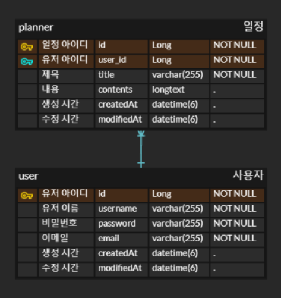

# 일정 관리 앱 Develop
유저를 회원가입, 로그인 등을 해서 해당 유저의 일정을 CRUD 하는 앱 입니다.

 

## 🕰 개발 기간
- 2025.02.08 ~ 2025.02.13

 

## 🛠 과제 설명
- Session / Cookie를 받아 유저의 회원가입, 로그인 인증/인가
- 유저가 Session을 받은 상태일 때만 일정을 CRUD 가능

 

## 🔍 Tech Stack

  
  
  
  

 

## 🏹 Trouble Shooting
**HttpServletRequest 없이 세션 가져오기**

트러블슈팅 링크 : <[https://velog.io/@cheoni5417/Trouble-Shooting-%ED%98%84%EC%9E%AC-%EC%84%B8%EC%85%98%EC%9D%84-HttpServletRequest-%EB%A7%A4%EA%B0%9C%EB%B3%80%EC%88%98-%EC%97%86%EC%9D%B4-%EA%B0%80%EC%A0%B8%EC%98%A4%EA%B8%B0)>

 

## 🎫 API
| 기능            | Method | URL           | Request                                                               | Response                                                                                | Status Code                                    |
|---------------|--------|---------------|-----------------------------------------------------------------------|-----------------------------------------------------------------------------------------|------------------------------------------------|
|유저 회원가입| POST   |/api/users/signup| {"username" : "이름" "password" : "1234" "email" : "ab12@abc.com" | {"id" : 1 "username" : "이름" "email" : "ab12@abc.com"}                             | 응답 성공 시 : 200 조건 충족 안할 시 : 400              |
|유저 로그인| POST   |/api/users/login| {"email : "ab12@abc.com" "password" : "1234"}                      |                                                                                         | 응답 성공 시 : 200 해당 이메일이 없을 시 : 404 비밀번호 틀릴 시 : 403 |
|유저 로그아웃| POST   |/api/users/logout|                                                                       |                                                                                         | 응답 성공 시 : 200                                  |
|로그인 상태 확인| GET    |/api/users/sessions|                                                                       |                                                                                         | 응답 성공 시 : 200 로그인 상태 아닐 시 : 401             |
|유저 단건 조회| GET    |/api/users/{id}|                                                                       |                                                                                         | 응답 성공 시 : 200 해당 아이디 없을 시 : 404             |
|비밀번호 변경| PUT    |/api/users/{id}| {"oldPassword" : 1234 "newPassword" : "1111"                       |                                                                                         | 응답 성공 시 : 200 두 비밀번호 다를 시 : 403             |
|유저 삭제| DELETE |/api/users/{id}|                                                                       |                                                                                         | 응답 성공 시 : 200 해당 아이디 없을 시 : 404             |
|일정 생성| POST   |/api/planners| {"title" : "제목" "contents" : "내용" "username" : "이름"              | "id" : 1 "title" : "제목" "contents" : "내용" "username" : "이름"                    | 응답 성공 시 : 201 해당 유저 이름 없을 시 : 404           |
|일정 전체 조회| GET    |/api/planners?username=이름| | { {"id" : 1 "title" : "제목" "contents" : "내용" "username" : "이름" ...} } | 응답 성공 시 : 200 해당 유저 이름 없을 시 : 404           |
|일정 단건 조회| GET    |/api/planners/{id}?username=이름| | {"id" : 1 "title" : "제목" "contents" : "내용" "username" : "이름"}                  | 응답 성공 시 : 200 해당 유저 이름 없을 시 : 404           |
|일정 수정| PUT    |/api/planners/{id}|"title" : "수정" "contents" : "수정" "username" : "이름"| {"id" : 1 "title" : "수정" "contents" : "수정" "username" : "이름"}| 응답 성공 시 : 200 해당 유저 이름 없을 시 : 404           |
일정 삭제| DELETE |/api/planners/{id}?username=이름| | | 응답 성공 시 : 200 해당 유저 이름 없을 시 : 404                                               |

 

## 📦 ERD

